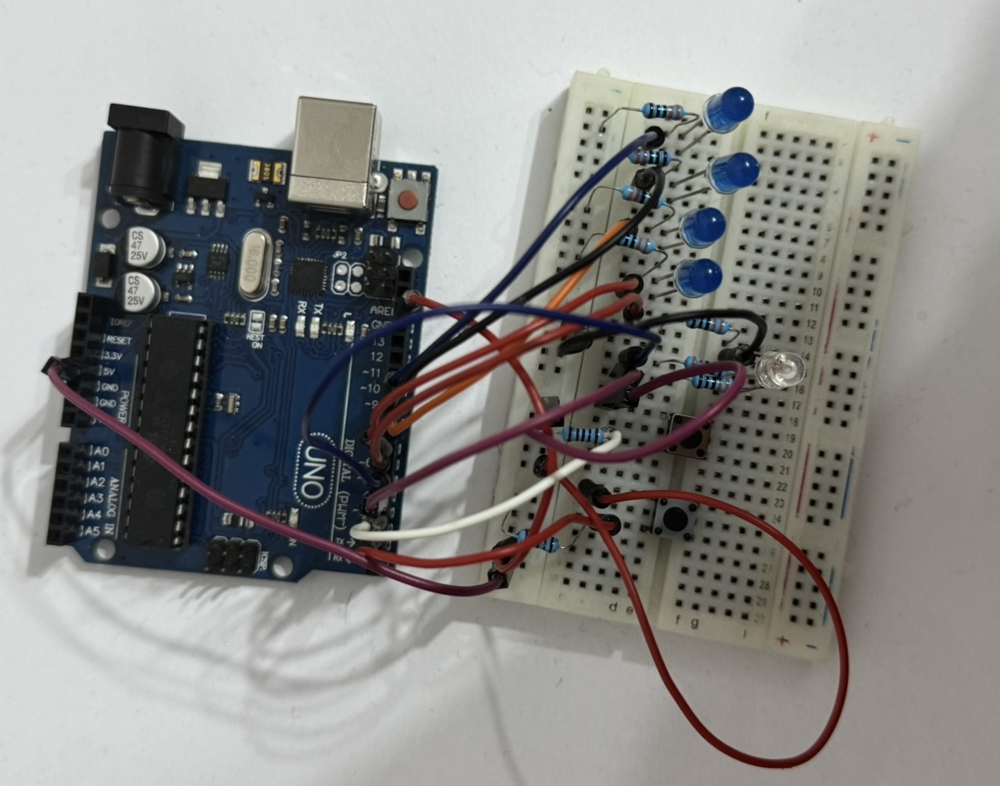
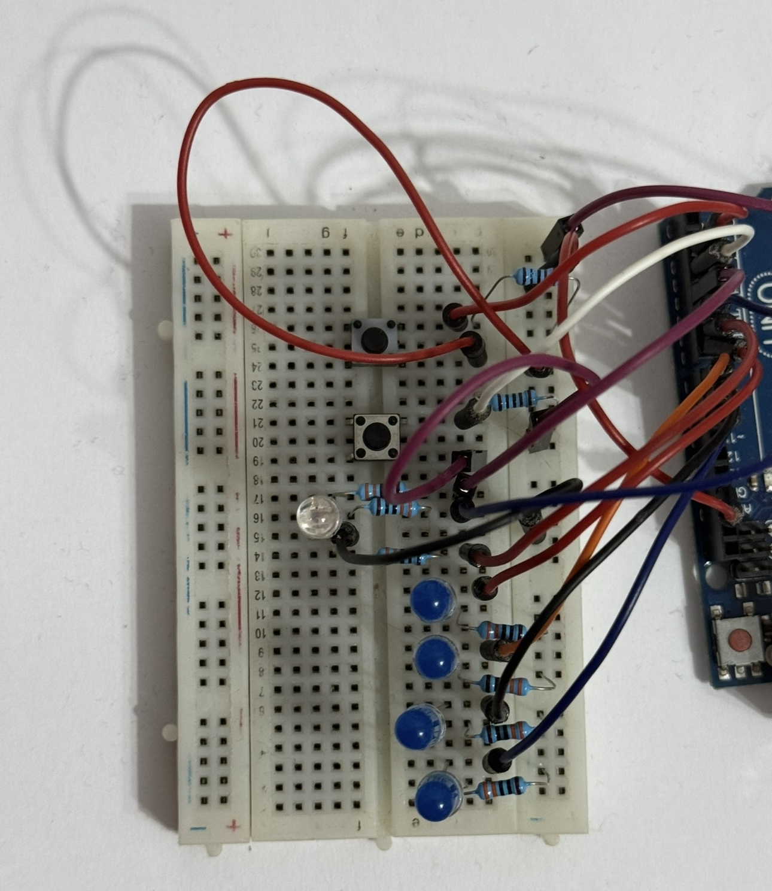
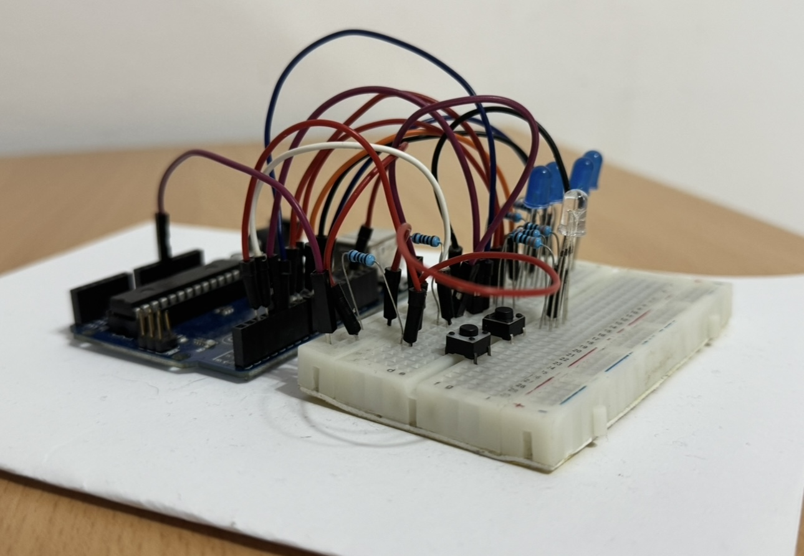
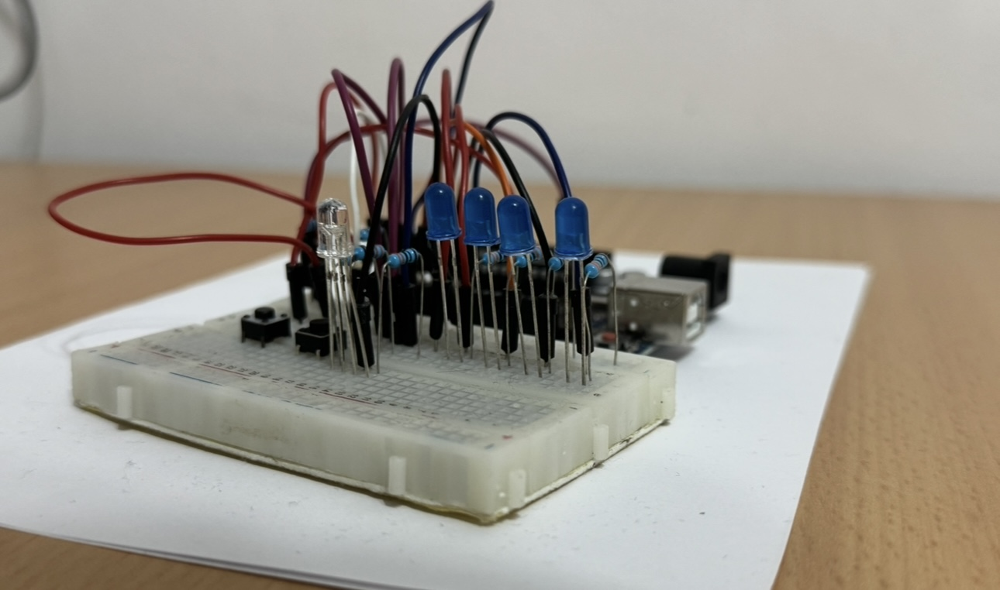

# Homework 1: EV Charger

## Description
For this project, I simulated a charging station for an electric vehicle using a system composed of multiple LEDs and two buttons.

## Tehnical Task
The purpose of the project was to replicate the behavior of a real charging station, where:
* The station can be either free or occupied, with the status indicated by an RGB LED: red for occupied, green for free;
* Charging is represented by four LEDs, each showing a different level of charge (LED1 - 25%, LED2 - 50%, LED3 - 75%, LED4 - 100%);
* A short press of the start button initiates the charging process, and the charging station's status becomes "occupied" (the RGB LED turns red). Pressing the button during the charging process will not affect the charging station;
* A long press of the stop button (≥ 1 second) interrupts the charging and resets the station to the free state (the RGB LED turns green);
* Upon completion or forced interruption of the charging process by pressing the stop button, all four LEDs will blink three times;
* The implementation takes debouncing into account to ensure accurate reading of button presses;

## Components Used
* 4x blue LEDs - show the charging level, each represeing 25%
* 1x RGB LED - shows the state of the charging station
* 2x Buttons - for starting and stopping the charging process
* 7x 330Ω rezistors - for the LEDs
* 2x 1KΩ rezistors - for the two buttons
* 1x Arduino Uno (ATmega328P microcontroller)
* 1x Breadboard
* 14x Colorful wires

## TinkerCAD Implementation

## Physical Implementation

## Video
[Video](https://youtu.be/7g0XaMN5Gg0)