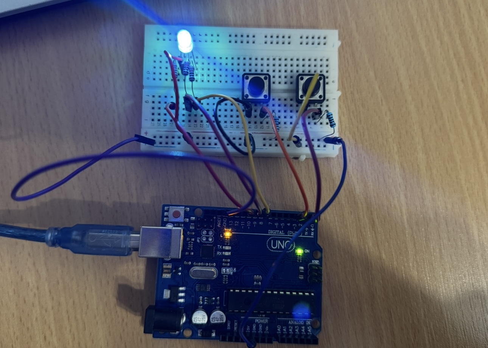

#  Homework 2: TypeRacer Game

## Description
For this project, I created a game similar to TypeRacer using an RBG LED and two push buttons.

## Tehnical Task
The purpose of this project was to replicate some basic game-like mechanisms:
* The game has three states: IDLE, STARTING AND RUNNING.
* Before the game, the player must select the difficulty (using a specific button that cycles through Easy, Medium, and Hard) or the game with not start and a specific message will be dispayed in the terminal.
* The selected difficulty level will be displayed in the terminal, along with the number of seconds available for typing each word.
* Pressing the difficulty button after the game started has no effect.
* The game will start when the start button is pressed. Using the same button, the game can be stopped at any point.
* At the start of the game, the RGB LED will light up 3 times, and a countdown will begin, after which the player will receive words in the terminal. If the user types the word incorrectly, the LED will turn red for a second to acknowlege the mistake and blue until the word is typed correctly or until the word changes.
* Each game round lasts 30 seconds, at the end a specific message and the number of correctly typed words will be displayed in the terminal. 
* Using "Backspace", the player can corrcet any mistakes that could appeare while typing a word.
* At the end of every round, the game's difficulty wil reset and the payer will need to choose one again.
* For each round, the words are randomly selected from a defined list with 50 options.
* The words list was generated using https://randomwordgenerator.com/.

## Components Used
* 1x RGB LED - shows the game status and lets the player know if the words are correct or not
* 2x Buttons - used for starting/stopping the game and for selecting the difficulty
* 3x 330Ω rezistors - for the RGB LED
* 2x 1KΩ rezistors - for the buttons
* 1x Arduino Uno (ATmega328P microcontroller)
* 1x Breadboard
* 10x Colorful wires

## Wokwi Implementation

[Simulation](https://wokwi.com/projects/413031030234506241)

## Physical Implementation

## Video
[Video](https://youtu.be/d___EHGeF7Q)