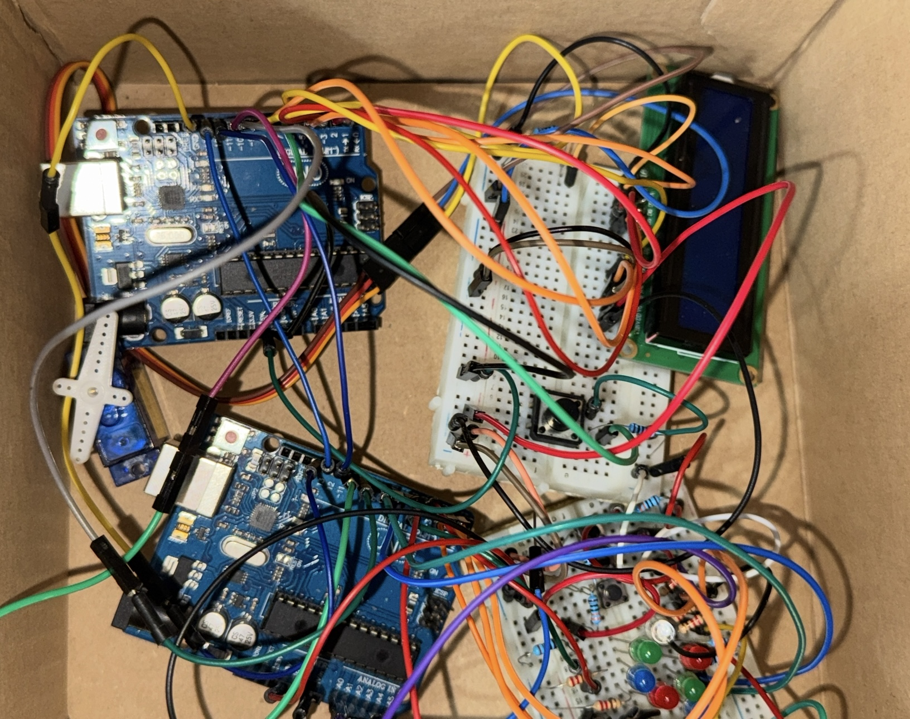

#  Homework 3: QuickTime

## Description
In this assignment, we created a competitive reflex game for two players, where both participants will compete to achieve the highest score, testing their reaction speed.

Each player will have their own buttons and LEDs, and the game will take place over several rounds. The goal of each player is to press the button corresponding to the color displayed on their team's RGB LED as quickly as possible. Each player's score will be displayed on an LCD screen and updated throughout the game. At the end of the game, the player with the highest score will be declared the winner.

## Components Used
* 6x LEDs (2 groups of 3 LEDs each, with different colors in each group)
* 2x RGB LEDs (1 for each player)
* 6x buttons (3 for each player)
* 1x LCD
* 1x servo motor
* 2x Breadboards
* Jumper wires
* 2x Arduino Uno

## TinkerCAD Implementation

## Physical Implementation

## Video
[Video](https://youtu.be/qsjsgxqzRYw)